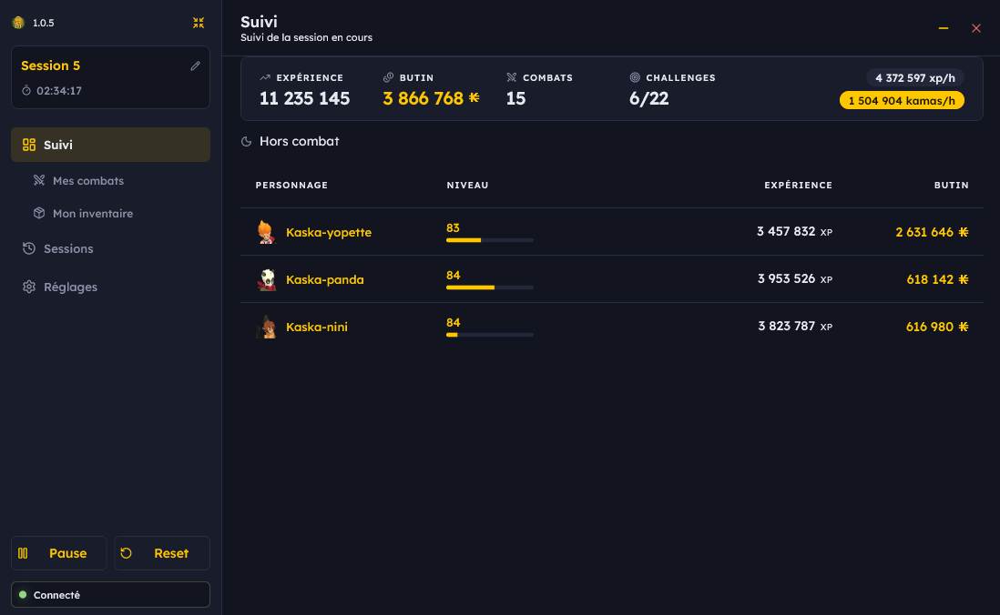
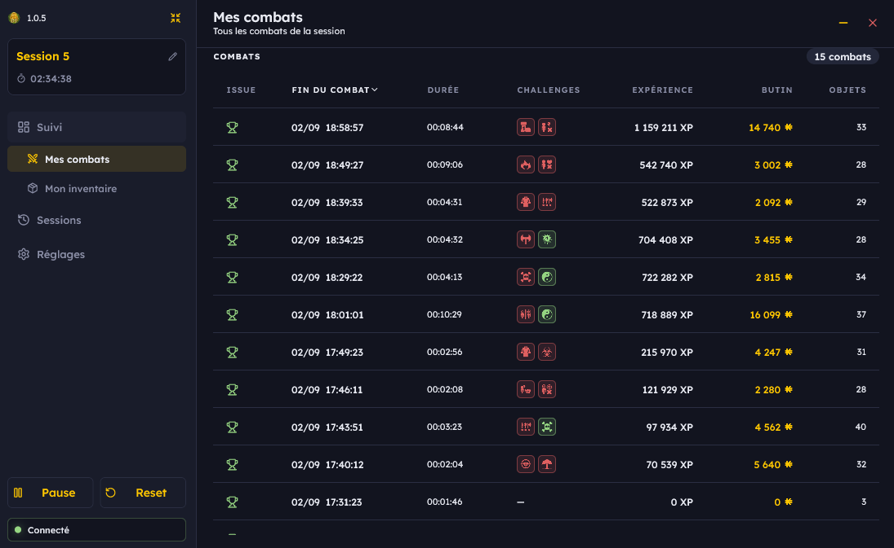
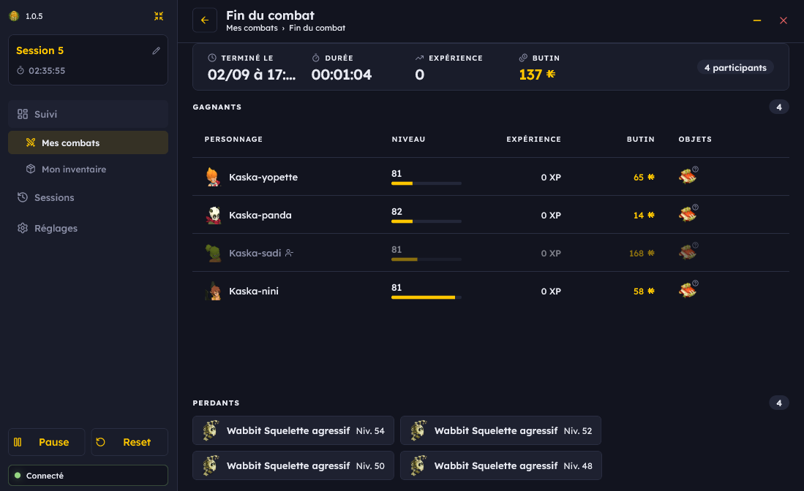
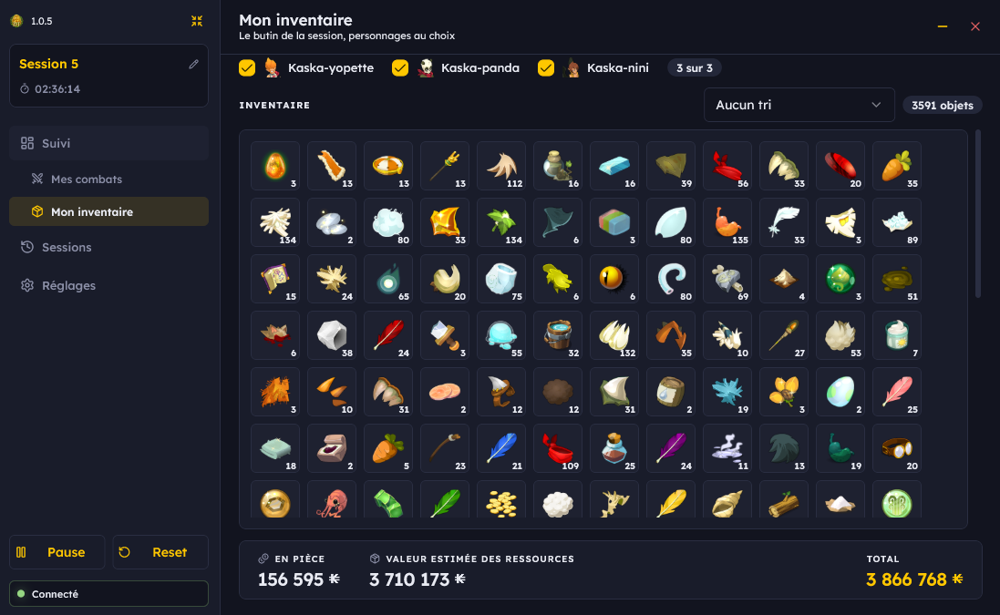
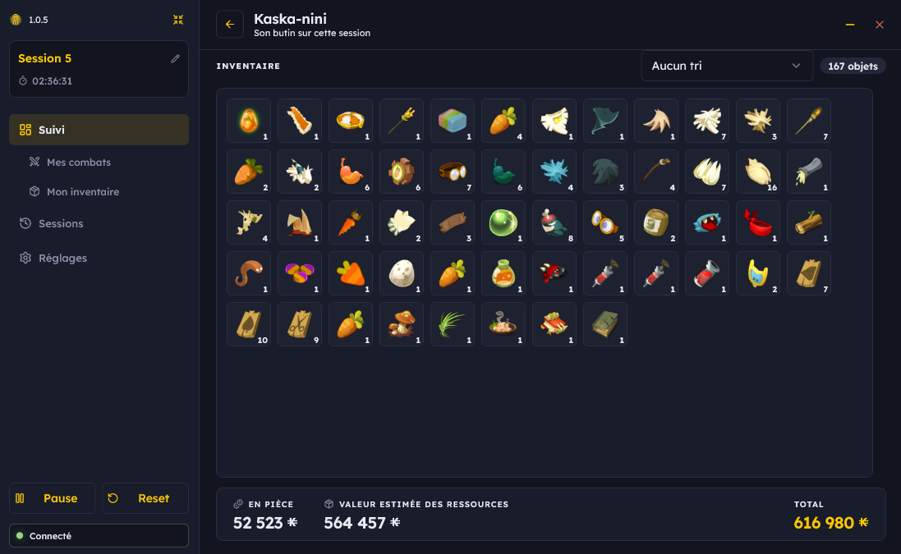
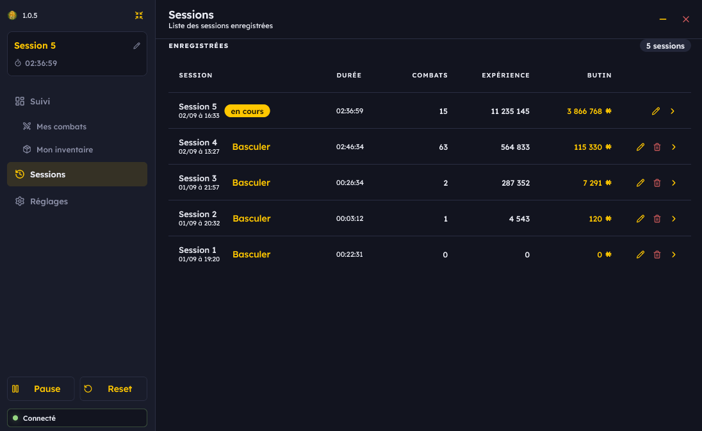
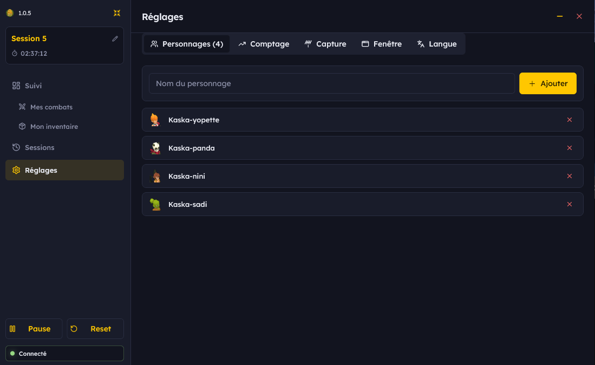
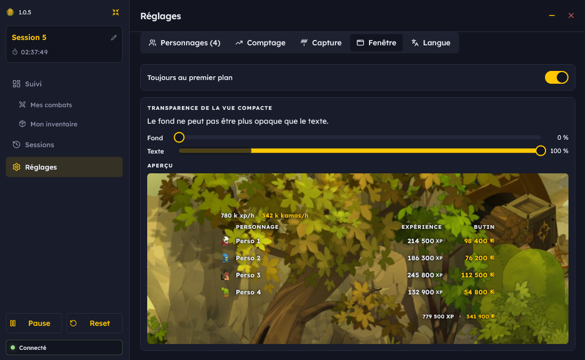
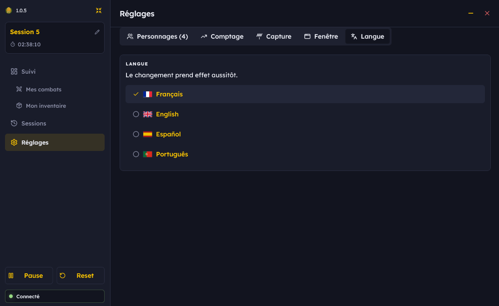
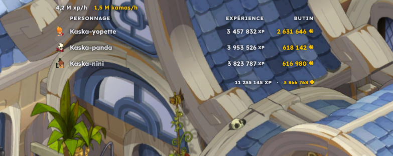

<p align="center">
  
</p>

<h1 align="center">DTracker</h1>

<p align="center">
  Compteur de session pour Dofus 3 — expérience, kamas, butin et combats,
  <br>lus sur le réseau et affichés à côté du jeu ou par-dessus.
</p>

---

DTracker mesure l'expérience, les kamas, le butin et les combats d'un ou
plusieurs personnages au fil d'une session de jeu, et conserve chaque session
pour la relire ensuite. L'affichage se fait dans une fenêtre ordinaire, ou dans
une bande translucide posée par-dessus le jeu.

L'outil est **strictement passif** : il lit le trafic réseau que le serveur
envoie déjà au client. Il n'écrit rien, n'envoie rien au jeu et n'automatise
rien. Voir [Cadre d'action](#cadre-daction).

- **Plateforme** : Windows 10 et 11
- **Prérequis** : [npcap](https://npcap.com/#download) — un mégaoctet
- **Langues** : français, anglais, espagnol, portugais

---

## Fonctionnalités

### Suivi de la session en cours



Le bandeau donne les totaux de la session — expérience, butin, nombre de
combats, challenges réussis sur challenges tentés — et les cadences horaires
calculées sur le temps réellement joué : les pauses ne comptent pas.

Le tableau détaille chaque personnage suivi : niveau, progression dans le
niveau, expérience gagnée et valeur du butin. Les kamas ramassés et la valeur
marchande estimée des ressources sont additionnés à partir des prix moyens que
le serveur diffuse.

Le panneau de gauche porte la durée de la session, son nom — modifiable —, les
commandes de pause et de remise à zéro, et l'état de la capture réseau.

### Historique des combats



Chaque combat de la session est enregistré avec son issue, son heure de fin, sa
durée telle que le serveur l'annonce, les challenges tentés et leur résultat,
puis les gains. Toutes les colonnes se trient d'un clic ; un second clic
inverse l'ordre.

### Détail d'un combat



Le récapitulatif est conservé tel que le jeu l'a affiché : les vainqueurs
d'abord, avec le niveau et la progression du moment, puis les vaincus. Les
adversaires sont nommés et groupés par espèce et par grade.

Un personnage qui participait au combat sans figurer dans la liste des
personnages suivis apparaît en retrait : ses gains restent visibles mais
n'entrent dans aucun total.

### Inventaire de la session



Le butin cumulé du groupe, en sélection libre de personnages. Le pied de page
sépare les kamas ramassés de la valeur estimée des ressources.



Le même inventaire pour un seul personnage, accessible depuis sa ligne dans la
page de suivi.

### Sessions enregistrées



Chaque session est archivée à sa clôture et reste consultable : durée, nombre
de combats, expérience, butin. Une session archivée peut être renommée,
supprimée, ouverte dans le détail, ou redevenir la session courante.

### Réglages



Les personnages à suivre sont déclarés par leur nom. Seuls ceux-là entrent dans
les totaux, ce qui permet de jouer en groupe sans mélanger les compteurs.



La vue compacte se règle en opacité, séparément pour le fond et pour le texte,
avec un aperçu en direct. L'onglet gère aussi le maintien au premier plan.



Quatre langues sont disponibles et le changement prend effet immédiatement.
D'autres peuvent être ajoutées : voir [Traduire l'interface](#traduire-linterface).

### Vue compacte



Une bande translucide, sans bordure, maintenue au premier plan et posée
par-dessus la fenêtre du jeu. Elle porte les cadences, les gains par personnage
et les totaux. Sa position et sa taille sont conservées, et elle peut être
verrouillée pour éviter de la déplacer par mégarde.

---

## Cadre d'action

Cette section décrit ce que le programme fait et ne fait pas. Chaque point est
vérifiable dans les sources.

### Ce que DTracker lit

DTracker ouvre les interfaces réseau de la machine en lecture, par
l'intermédiaire de npcap, avec un filtre appliqué **dans le noyau** de Windows
qui ne laisse passer que le port TCP 5555 — celui du protocole de jeu. Il
réassemble les flux TCP et décode les messages.

Le protocole de Dofus 3 circule **en clair**, sans TLS, sous la forme
`[longueur en varint][message protobuf]`. Chaque message porte un
`google.protobuf.Any` dont le `type_url` vaut `type.ankama.com/<code>`, où
`<code>` est un identifiant obfusqué de trois lettres.

L'information exploitée est celle que le serveur envoie déjà au client,
c'est-à-dire celle que le joueur a sous les yeux. DTracker n'a accès à rien de
plus.

### Ce que DTracker ne fait pas

- **Aucun paquet n'est émis** vers le serveur ou vers le client du jeu. La
  capture est en lecture seule.
- **Aucune interaction avec le processus du jeu** : pas de lecture ni
  d'écriture en mémoire, pas d'injection de bibliothèque, pas de hook.
- **Aucune modification du client** : aucun fichier du jeu n'est écrit.
- **Aucun proxy, aucun intermédiaire** : le trafic n'est ni détourné ni
  réécrit, il est observé sur la carte réseau.
- **Aucune automatisation** : aucune frappe, aucun clic, aucune commande n'est
  produite. Le programme n'agit jamais en jeu.

### Ce qui sort de la machine

Rien, à une exception près : au démarrage, une requête HTTPS vers
`api.github.com` demande le numéro de la dernière version publiée. Elle
n'emporte aucune donnée de jeu, et échoue en silence sans réseau.

Les mesures, les archives de sessions et les réglages restent dans
`%APPDATA%\DTracker`. Rien n'est transmis à un service tiers.

### Données du jeu

Les noms d'objets, les images et les tables de correspondance proviennent du
client Dofus installé sur la machine. DTracker les extrait **une fois**, au
premier lancement, en lecture seule, et les écrit dans son propre dossier. Ces
fichiers appartiennent à Ankama et ne sont pas redistribués avec le programme.

Sans cette extraction l'outil fonctionne : les gains, les combats et les
cadences sont exacts. Seuls les noms et les images manquent, un objet
s'affichant alors « Objet 1731 ».

### Responsabilité

DTracker est un outil de lecture et d'analyse. Il reste à la charge de chacun de
vérifier que son usage est compatible avec les conditions d'utilisation du jeu.

---

## Installation

1. Installer [npcap](https://npcap.com/#download). Ce pilote est indispensable :
   lire le trafic réseau se fait dans le noyau de Windows, et aucun programme ne
   peut s'en passer. Sa licence interdit sa redistribution, il doit donc être
   installé séparément. L'installateur de DTracker vérifie sa présence.
2. Télécharger l'archive de la dernière [release](../../releases) et lancer
   `DTracker-<version>-installateur.exe`.

L'installation se fait pour le compte utilisateur courant : aucun mot de passe
administrateur n'est demandé et rien n'est écrit hors des dossiers personnels.
Ni Wireshark ni Python ne sont nécessaires.

Les mises à jour sont proposées au démarrage et s'installent sans intervention.
Les réglages, le cache de prix et l'historique des sessions vivent dans
`%APPDATA%\DTracker`, où l'installateur n'écrit jamais.

Détails, désinstallation et diagnostic : [INSTALLATION.md](INSTALLATION.md).

---

## Pour les développeurs

### Organisation

```
capture/   bibliothèque de décodage du protocole (Python, sans dépendance)
app/       application de bureau (Flutter, Windows)
docs/      captures d'écran de la documentation
```

L'application lance la bibliothèque comme un sous-processus qui émet du NDJSON
sur sa sortie standard : un événement de jeu par ligne. Depuis les sources
c'est `python -m dofus_stats.cli.stream` ; une fois installée, c'est
l'exécutable gelé que produit `capture/tools/gele.py`, ce qui évite d'exiger
Python de l'utilisateur.

```bash
cd capture && python tests/test_regression.py    # 178 vérifications
cd app     && flutter test                       # 204 cas
cd app     && flutter run -d windows
```

### Utilisation de la bibliothèque

```python
from dofus_stats import Reader, FightEnd

for event in Reader.from_pcap("session.pcap", hosts="hosts.json").events():
    if isinstance(event, FightEnd):
        for p in event.participants:
            print(p.name, p.xp, p.kamas, [(s.item_id, s.quantity) for s in p.loot])
```

`Reader.from_live()` remplace `from_pcap` pour l'écoute en direct ; le reste est
identique. La bibliothèque n'a aucune dépendance Python, et son interface est
documentée dans [capture/README.md](capture/README.md).

Les événements produits couvrent les fins de combat et leur récapitulatif
complet, les succès, les caractéristiques, les mouvements d'inventaire avec
leur provenance, les challenges, le déroulement des tours, les dégâts et leurs
éléments, les pods et le solde de kamas.

### Jeux de données

Trois ensembles, de nature différente.

**Captures de référence** — `capture/captures/`, versionnées.

Une trentaine d'enregistrements du trafic de jeu, chacun accompagné d'un fichier
`hosts_<nom>.json` qui associe chaque flux TCP à un personnage. Ce sont les
artefacts centraux du projet : les codes de messages sont obfusqués et changent
à chaque correctif du jeu, et ces enregistrements sont le seul moyen de rejouer
une scène et de refaire le raisonnement.

Elles ont été filtrées au seul port du jeu par `tools/reduis.py`. Les
enregistrements antérieurs contenaient tout le trafic de la machine : sur l'un
d'eux, 176 trames utiles sur 30 975.

**Dictionnaires de protocole** — `capture/data/`, versionnés.

| Fichier | Contenu |
|---|---|
| `messages.json` | 62 codes de messages nommés, et des notes sur les structures établies |
| `codes.json` | 320 codes rencontrés, avec leur forme et un exemple de contenu |

`messages.json` porte le résultat du travail d'identification : le sens attribué
à un code, et la façon dont il a été établi. `codes.json` est un inventaire
produit par `tools/veille.py`, qui recense au fil de l'eau tout code jamais vu,
compris ou non.

**Données extraites du client** — `capture/data/`, non versionnées.

Fichiers d'Ankama, produits par `extract_data.py` et `extract_images.py`. Ils ne
sont pas redistribuables et se régénèrent à partir du client installé.

| Chemin | Contenu |
|---|---|
| `data/labels/<catégorie>.json` | identifiant vers libellé, pour 111 catégories |
| `data/items_noms.json` | 21 599 noms d'objets |
| `data/objets.json` | 21 748 objets : nom, poids, type |
| `data/monstres.json` | 5 135 monstres, et le niveau de chaque grade |
| `data/images/<catégorie>/` | images du jeu, avec un index reliant `iconId` au fichier |

### Outils d'analyse

```bash
python tools/enregistre.py captures/scene01 --secondes 120
python tools/chronologie.py captures/scene01 --de 15 --a 32
python tools/chronologie.py captures/scene01 --codes iua,ivj,kcr
python tools/chronologie.py captures/scene01 --objet 14471
python tools/nouveaute.py captures/scene01 --reference captures/farm01.pcap
python tools/reduis.py captures/scene01.pcapng
```

`enregistre.py` écrit une capture rejouable et la photographie des connexions à
côté. Enregistrer plutôt qu'écouter en direct est nécessaire : identifier un
message demande de relire la même scène de nombreuses fois en changeant
d'hypothèse, et une action en jeu ne se rejoue jamais à l'identique.

`chronologie.py` recense les codes d'une capture, borne une fenêtre de temps, ou
ne retient que les messages citant un identifiant donné. La méthode qui a servi
à identifier la plupart des messages tient en trois passes : recenser pour
isoler les candidats, borner pour lire la séquence complète — commande du
client, réponse du serveur, conséquences —, puis confirmer sur un identifiant
connu.

`nouveaute.py` compare une capture à un corpus de référence et isole ce qui n'y
figure pas : un message déclenché par une action précise ressort par contraste.

`veille.py` tourne plusieurs heures sans surveillance et note tout code inédit.

### Vérification

`capture/tests/test_regression.py` exécute 178 vérifications sur la trentaine de
captures. Chacune reprend une valeur confrontée à ce que le jeu affichait au
moment de l'enregistrement. C'est le seul garde-fou possible quand les noms de
messages ne veulent rien dire : plusieurs correspondances se sont révélées
fausses en cours de route, et chaque cas est resté dans les tests.

`app/test/` contient 204 cas couvrant la comptabilité des sessions, la
sérialisation des archives, la mise en page des tableaux et la complétude des
traductions.

### Traduire l'interface

Les textes sont tenus dans une table unique, `app/tools/langues.py`, qui génère
une classe par langue. La classe de base étant abstraite, une traduction
incomplète ne compile pas.

Ajouter une langue demande une colonne dans la table, une valeur dans
l'énumération `Langue` et un drapeau dans `app/assets/drapeaux/`.
